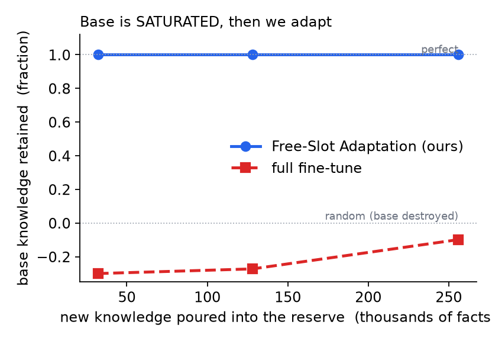
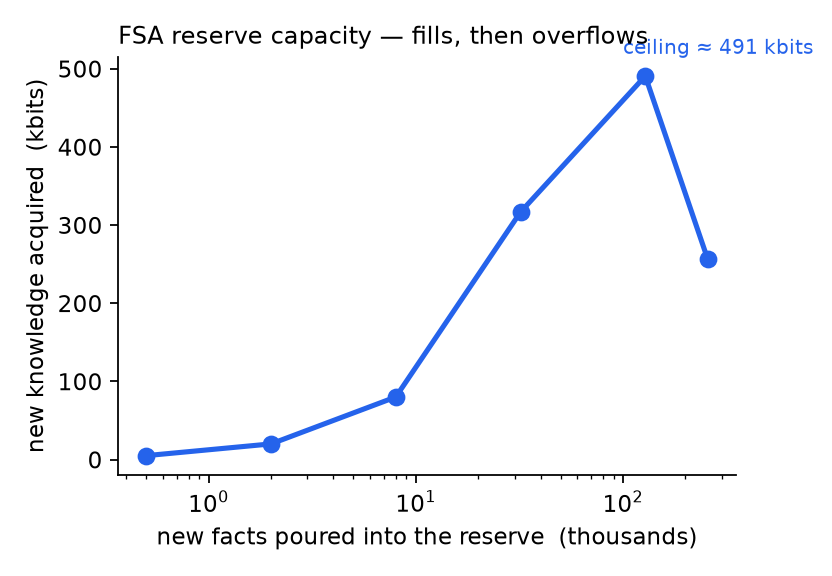
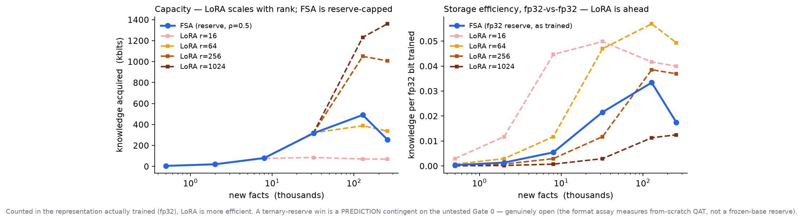
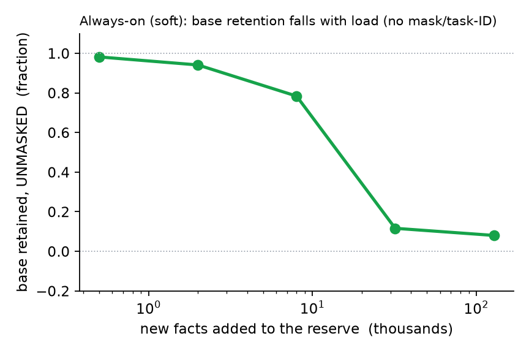

<p align="center">
  
</p>

<h1 align="center">Epigenetic Language Models</h1>

<p align="center"><b>Lifelong learning by intercalating knowledge into structural zeros.</b></p>

<p align="center">The base weights never change. New knowledge is written into the zero slots a compressed model already has, with no new parameters, and can be erased bit-exactly when a user asks to be forgotten. The method is <b>Free-Slot Adaptation (FSA)</b>.</p>


<p align="center">
  📄 <a href="paper/freeslot.pdf"><b>Read the paper (PDF)</b></a> <i>(AI-generated)</i>
  &nbsp;·&nbsp; <a href="ROADMAP.md"><b>Roadmap</b></a>
  &nbsp;·&nbsp; <a href="#results">Results</a>
  &nbsp;·&nbsp; <a href="#honest-accounting-what-is-and-isnt-free">What's actually free</a>
  &nbsp;·&nbsp; <a href="#reproduce">Reproduce</a>
</p>

> [!NOTE]
> **The paper and this write-up were generated with AI assistance**, from experiments run and verified by the authors. Numbers are reproducible with the code in [`src/`](src/); treat the prose as a draft under human review, not a peer-reviewed result.

> [!WARNING]
> **What is and isn't tested yet (read this first).** The synthetic results below are a **mechanism demonstration**: `src/freeslot.py` trains **dense fp32 weights** with a random 50% mask — `pair8`/ternary *never enters that adaptation loop*. Real-model experiments on the lambda 8B ternary MoE are reported separately: [isolated real experts](experiments/real_lambda/FINDINGS.md) and [end-to-end on the full model](experiments/end_to_end/E2E_FINDINGS.md) (in progress; so far FSA matches unregularized LoRA's recall with about 8× less damage to general text, while a regularized LoRA still holds the low-damage end of the frontier). The "zero-forgetting" result is **true by construction** (freeze a disjoint support → it can't change; retention 1.000 is a unit test that the mask was applied, and would hold even if the reserve learned nothing) — it is an invariant, not a theorem or an empirical win. Whether FSA actually *exists* for the ternary format and on a real transformer is the open question. See the [**roadmap**](ROADMAP.md) for the two gating experiments (ternary-reserve-vs-fp32, then a byte-matched real-model run vs QLoRA) that decide whether this matters. Two independent adversarial reviews both flagged these as the first things to settle.

---

## Why "epigenetic"

Epigenetic changes alter how a genome is expressed without changing the DNA, and they can be reversed. Here the base weights play the role of the genome: they are frozen and never edited. What the model learns after deployment lives in a separate, sparse layer written into slots that were exactly zero, so removing it restores the original model bit for bit. That is the whole analogy; everything else on this page is measured.

## The one-line idea

**`pair8`'s format rule** forces at least half of every block's weights to zero (ternary alone doesn't). Those zeros can instead hold a new skill: **freeze the learned weights, write new knowledge only into the zero slots, and keep a mask marking which slots belong to which skill.** The *masked* base is preserved exactly and the logical tensor shape is unchanged — but filling zeros **costs storage** (added bytes once a block's 2-of-4 codebook is full), so this is a **trade against compression, not free capacity**, and (per our own numbers) a cost-structure story rather than a win over LoRA.

This is [PackNet](https://arxiv.org/abs/1711.05769) (train → prune → freeze → train the freed weights) — except the pruning is already done *by the quantization format*, in a known structural pattern, on a model that is already small.

## What is pair8?

`pair8` is an extreme weight format. Take the weights in **aligned blocks of 8** (four adjacent pairs). The rules:

- every weight is **ternary** — `{ -1, 0, +1 }` times a block scale;
- **at most 2 of the 4 pairs** in a block may be non-zero.

That second rule forces **≥ 50% of all weights to be exact structural zeros**. A block has only **417 reachable states**, so it encodes in **≈ 1.088 information-bits per weight** (1.125 bits when packed) — vs 16 bits for bf16. The zeros aren't a rounding artifact; they're *guaranteed by the format*, which is exactly what makes them a predictable reserve.

```
one pair8 block of 8 weights  (· = forced zero,  ■ = ternary ±1)
┌─────┬─────┬─────┬─────┐
│ ■ ■ │ · · │ ■ ■ │ · · │   ← ≤ 2 of 4 pairs active  ⇒  ≥ 4 of 8 weights are zero
└─────┴─────┴─────┴─────┘
```

## What the sparsity actually buys you

Those guaranteed zeros are a **reserve.** Reusing them is cheap in two narrow senses, not free in a third, and smaller than it first looks:

| | FSA into the reserve | caveat |
|---|---|---|
| new **logical parameters** | **0** | same element count — we only make some zeros non-zero |
| extra **compute (FLOPs)** | **0** *on a dense GEMM* | **kernel-conditional** — a pair-sparse kernel (the point of the format) does *more* work once zeros are filled |
| extra **storage** | **not free** — ~`1.58` bits/filled weight (a pre-assigned ternary pair) + addresses + mask | filling zeros *de-compresses* the file; it's a compression↔capacity **dial** |

Two honest limits: (1) at ρ=0.5 a block already using its 2-of-4 pairs has **no in-codebook room** for more — the full reserve requires a **sidecar** (patches that leave `pair8`), so the writable reserve is *not* a free `(1−ρ)·N`. (2) Whether a filled reserve beats a LoRA adapter per bit-of-knowledge is **empirical** — and [our numbers say LoRA wins](#results), so this is a cost-structure story, not a slogan.

## How Free-Slot Adaptation (FSA) works

<p align="center">
  
</p>

```
Base: train the model in format Φ (pair8 / ternary) with SR-STE.
      Support S₀ = active (non-zero) slots.  Reserve Z₀ = the structural zeros,  |Z₀| ≥ (1-ρ)·N.

Adapt to a new domain d:
  1. FREEZE W[S₀] and all shared params (biases, norms, router gates).   # base is immutable
  2. Open a reserve slice R_d ⊆ Z₀  (disjoint across domains);  train ONLY W[R_d] on domain d,
     with the WHOLE frozen base live  → the new skill learns on top of all old knowledge.
  3. Store the mask M_d marking R_d.

Inference:   base      → reserves OFF, use W on S₀ only.      # the base is ALWAYS present
             domain d   → use W on (S₀ ∪ R_d).                # base + that domain's add-on
```

**Masking does not remove the base.** `S₀` is live in every configuration; the mask only selects *which reserve add-on* is switched on. The cost is that you must know the input's domain to pick `R_d` (task-ID, as in PackNet) — and you can't leave *all* domains on at once (that's what the [middle-ground](#middle-ground-one-always-on-model) modes address).

## Why it works — the math

**Zero-forgetting, by construction (not a theorem, not a finding).** Let `f₀` be the model restricted to the base mask `M₀` (only `S₀` active). Adapting domain *d* modifies only `W[R_d]` with `R_d ∩ S₀ = ∅`, and all shared params are frozen. So `f₀(x)` depends only on `W[S₀]` and shared params — **none of which changed** — hence `f₀` after adaptation **=** `f₀` before, exactly. This is an **invariant of freezing a disjoint support** (the same property PackNet has); the empirical **retention 1.000** is a *unit test that the mask was applied* — it would hold even if the reserve learned nothing, so we don't headline it. The real questions are whether the *enabled* reserve learns anything useful (Results), and whether you can avoid the mask at all (the [`soft`](#middle-ground-one-always-on-model) model / a router). Run it unmasked with another domain's reserve on and A degrades below random — **the mask is load-bearing**.

**Reserve capacity** is reported as *accounting, not a law*: measured knowledge-per-stored-bit (`κ_adapt`) × patch bits. We do **not** vary ρ or the per-slot cost, so fig 2 is a memorization curve, not a tested capacity law. Overfilling **reduces** net acquisition (the reserve weights interfere).

**Mask cost.** 1 bit / weight / domain for an arbitrary slice, or **~0** if `R_d` follows a fixed structural rule (domain *d* owns a fixed subset of the inactive pairs). *T* domains ⇒ ≤ *T* bits/weight. For a small domain the 1-bit mask can *dominate* the knowledge it gates, so the structural rule is what keeps FSA storage-competitive — this is part of what fig 3 measures.

## Results

Synthetic knowledge-capacity assay (disjoint fact sets A→B; `K = retained bits = N·log₂V − ΣCE/ln2`), base **saturated** with 128k facts, then adapted. Dense weights + a fixed mask isolate the *mechanism*.

<p align="center">
  
  
</p>

- **Retention is exactly 1.000** for FSA at every reserve load, while **full fine-tuning destroys the base** (retention < 0).
- The reserve fills to a **maximum (~490.6 kbits here) then declines** (256.5 kbits at 256k facts): a maximum under this training budget, not a proven intrinsic ceiling.

**Per-method, small reserve (500 new facts, max 5.0 kbits):**

| method | new knowledge acquired | base retained | extra params | extra FLOPs |
|---|---:|---:|---:|---:|
| **Free-Slot Adaptation (ours)** | **+5.0k (all)** | **1.000** (with mask) | **0** | **0** |
| full fine-tune | +5.0k | **−2.23 (forgot)** | 0 | 0 |
| frozen, no free slots | −72.7k (can't acquire) | 1.000 | 0 | 0 |
| LoRA (properly tuned) | learns small-N too | 1.000 (adapter off) | `r·(d_in+d_out)` | small |

**FSA vs tuned LoRA (full curve):**

<p align="center">
  
</p>

The honest picture: **LoRA is more capable** (at r≥256, tuned, it out-acquires FSA's ~490 kbit maximum) **and, counted in the representation we actually train (fp32), more storage-efficient** (κ≈0.057 at r=64 vs FSA ≈0.033). A ternary-reserve advantage is only a **prediction** contingent on [Gate 0](ROADMAP.md), and whether it holds is **genuinely open** — the format assay measures *from-scratch* QAT, not a *frozen-base* reserve, so it can't forecast this, and even a pessimistic ternary yield needn't fall below LoRA. We retract an earlier "~10× storage win," which divided fp32 knowledge by hypothetical trit storage (a unit conversion, flagged by both reviewers). Full numbers in [`results/RESULTS.md`](results/RESULTS.md).

> *(An earlier run also showed LoRA "collapsing" at larger N — an LR-instability artifact; LoRA's effective LR must scale down with fact-load. Re-tuned here.)*

## Middle ground: one always-on model

The hard mask gives a *provable* guarantee but needs task-ID and can't run all domains at once. Two relaxations trade the exact guarantee for a single deployable model with **cross-pollination** between old and new:

1. **Consistency-penalized reserve** — train `R_d` with the base frozen *and* a KL penalty on base inputs (base-only vs base+`R_d`). The reserve learns the new skill *without* disturbing the old → leave everything on, no mask, no task-ID, **bounded** (not exactly zero) forgetting.
2. **Soft-freeze** — give `S₀` a tiny learning rate so the base can *refine* on the new data, trading a little forgetting for genuine two-way cross-pollination.

First results (saturated base, 500 new facts, evaluated **unmasked** — base + reserve both always on, *no task-ID*):

| approach | base retained, unmasked | new acquired |
|---|---:|---:|
| hard FSA (reference) | −42.0 — *needs the mask* | +5.0k |
| **consistency-penalized reserve** | **0.98** | **+5.0k** |
| soft-freeze (5% base-gradient scale) | −4.6 — *base craters* | +5.0k |

So the **consistency penalty delivers a single always-on model that keeps 98% of the base *and* fully learns the new skill** — no mask required — but retention **degrades** as you add more (0.98 → 0.08), bought with full base-input replay (good for modest loads, not large ones). Letting a *saturated* base drift, by contrast, destroys it: the lesson is **freeze the base, constrain the reserve.**

<p align="center">
  
</p>

Both are modes in [`src/freeslot.py`](src/freeslot.py) (`soft`, `softfreeze`); full numbers in [`results/RESULTS.md`](results/RESULTS.md).

## Comparison & complementation to LoRA

| | LoRA | Free-Slot Adaptation |
|---|---|---|
| new parameters | `r·(d_in+d_out)` low-rank — **extra params + storage** | **0 new params**; reuses existing slots (storage = de-sparsification + mask) |
| extra compute | small extra matmuls | **none** — same GEMM, same shapes |
| structure | cross-weight **low-rank** residual | in-weight **sparse** reserve |
| base at inference | frozen; residual **always on** | frozen; reserve **masked per domain** (base always present) |
| exact zero-forgetting | only if residual disabled for base | **yes**, with the base mask |
| strongest at | global / stylistic shift | localized / factual knowledge |

**They are in principle stackable** — LoRA for low-rank cross-weight adaptation *plus* FSA for sparse in-weight capacity — but we have **not** tested the stack yet.

## Honest accounting: what is and isn't free

- **Free:** new parameters (0), extra compute/FLOPs (0), extra tensors/kernels (0), base forgetting under the mask (0).
- **Not free:** **storage** — filling zeros de-compresses the file (~1.088 bits/weight written + mask); it's a *compression↔capacity dial*. And you need **task-ID** at inference for the hard-mask variant.
- **Bounded:** reserve capacity (κ-limited, degrades if overfilled).
- **Being measured, not assumed:** whether FSA beats LoRA per bit-of-knowledge (fig 3); real-model validation (synthetic assay so far).

## Reproduce

```bash
# needs a CUDA GPU + torch; synthetic, ~minutes per arm
python src/kappa_binary.py                 # knowledge-capacity (κ) assay for each format
python src/freeslot.py --mode packnet  --facts-a 128000 --facts-b 500,2000,8000,32000 --steps 40000
python src/freeslot.py --mode lora --lora-rank 64 --facts-a 128000 --facts-b 500,2000,8000,32000 --steps 40000
python src/freeslot.py --mode fullft   --facts-a 128000 --facts-b 500,2000,8000,32000 --steps 40000
# figures:  python figures/make_figs.py experiments/saturate_then_adapt
```

`src/freeslot.py` — the FSA harness. Modes: `packnet` (=FSA), `lora`, `fullft`, `frozen_noslots` (control), `joint` (upper bound), plus the middle-ground modes. Each arm reports base-retention (masked **and** unmasked) and new-domain acquisition.

## Limitations (stated honestly)

- Needs a **per-domain mask + task-ID** at inference for the exact guarantee — *not* one unmasked model that knows everything (the middle-ground modes relax this).
- Storage is **traded against compression**, not free.
- Reserve capacity is **bounded** by κ and degrades if overfilled.
- The frozen base cannot *refine* in the hard-mask variant (additive only).
- Current evidence is a **synthetic MLP fact assay**; real-model / real-task validation is ongoing.

## Prior art

[PackNet](https://arxiv.org/abs/1711.05769) · [LoRA](https://arxiv.org/abs/2106.09685) · [LoRA Learns Less and Forgets Less](https://arxiv.org/abs/2405.09673) · BitNet b1.58 (ternary) · [LittleBit](https://arxiv.org/abs/2506.13771) (low-rank + binarized factors). FSA is complementary to the factorization route and specific to *format-reserved* sparse capacity.

## How claims were checked

Every claim here went through repeated rounds of adversarial review, and the write-up was revised until the findings stopped changing.

## License & attribution

Code: Apache-2.0. Paper & figures: CC-BY-4.0. By [Chutes.ai](https://chutes.ai) / Parallax. Paper and write-up AI-generated (see the note at the top).
