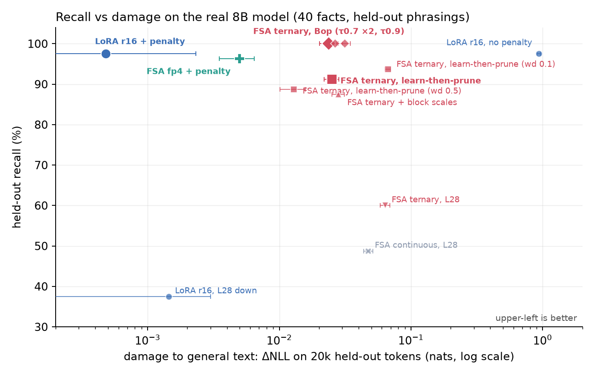
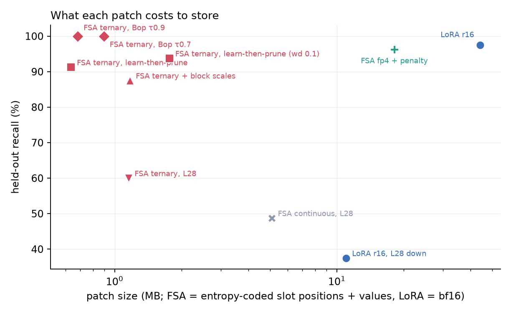
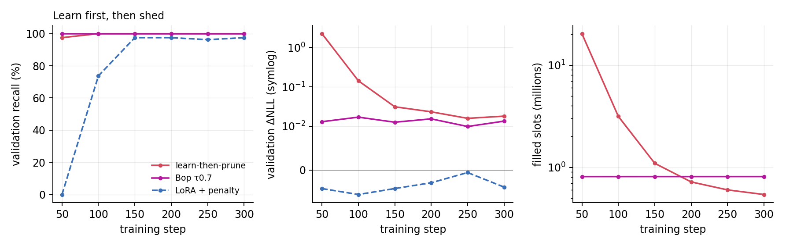
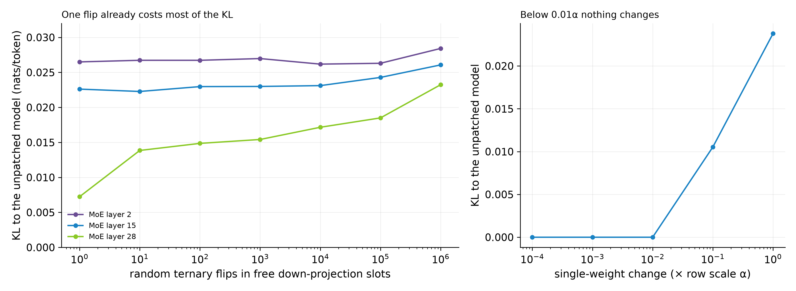
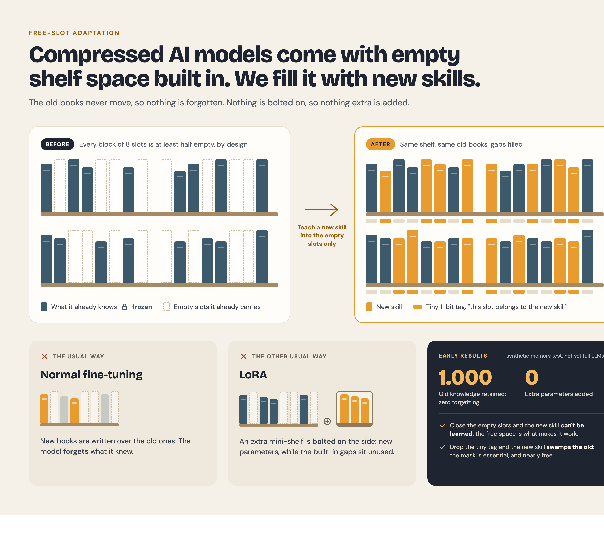

<p align="center">
  
</p>

<h1 align="center">Epigenetic Language Models</h1>

<p align="center"><b>Lifelong learning by intercalating knowledge into structural zeros.</b></p>

<p align="center">The base weights never change. New knowledge is written into the zero slots a compressed model already has, with no new parameters, and can be erased bit-exactly when a user asks to be forgotten. The method is <b>Free-Slot Adaptation (FSA)</b>.</p>

<p align="center">
  📄 <a href="paper/freeslot.pdf"><b>Read the paper (PDF)</b></a> <i>(AI-assisted)</i>
  &nbsp;·&nbsp; <a href="#results-on-the-real-8b-model-2026-10-09">Results</a>
  &nbsp;·&nbsp; <a href="#best-algorithms-so-far">Algorithms</a>
  &nbsp;·&nbsp; <a href="#how-free-slot-adaptation-works">How it works</a>
  &nbsp;·&nbsp; <a href="#reproduce">Reproduce</a>
  &nbsp;·&nbsp; <a href="ROADMAP.md">Roadmap</a>
</p>

> [!NOTE]
> **The paper and this write-up were generated with AI assistance**, from experiments run and verified by the authors. Treat the prose as a draft under human review, not a peer-reviewed result.

## Results on the real 8B model (2026-10-09)

Teaching 40 facts about a fictional person to the lambda 8B ternary MoE. Recall is measured on held-out phrasings
(including Q/A forms never seen in training); damage is ΔNLL on 20k held-out general-text tokens (± paired SE).

| method | held-out recall | general-text damage | patch | inference overhead |
|---|---|---|---|---|
| **FSA ternary, Bop writer (τ 0.7) + local output penalty** | **100%** | **+0.0015 ± 0.0017** | **740k slots (0.9–2.5 MB)** | **none, measured** (see serving below) |
| FSA ternary, Bop writer (τ 0.7), two runs | 100% / 100% | +0.027 ± 0.004 / +0.024 ± 0.004 | 812k / 670k slots (0.8–2.7 MB) | none (same kernel) |
| FSA fp4 slots + local output penalty | 96.3% | +0.005 ± 0.002 | 21M fp4 slots (18–80 MB) | needs fp4 slot support |
| FSA ternary, learn-then-prune (AdamW, weight decay 0.3) | 91% | +0.025 ± 0.003 | 542k slots (0.6–1.8 MB) | none (same kernel) |
| FSA ternary, learn-then-prune (AdamW, weight decay 0.5) | 88.7% | +0.013 ± 0.003 | 523k slots (0.6–1.8 MB) | none (same kernel) |
| *LoRA r16 + output penalty (baseline)* | *97.5%* | *+0.0005 ± 0.002* | *22M params (44 MB bf16)* | *extra matmul per token* |

<p align="center">
  
  <br>
  
</p>

Patch sizes count slot positions as well as values: the low figure entropy-codes the positions, the high one stores a
26-bit index per slot. Recall here is teacher-forced exact match on held-out phrasings (free-running generation is
being added). Every FSA row has bit-exact revoke. What these say:
- **Bop + the local output penalty matches LoRA's damage at full recall** (single run; seeds and free-running
  generation in progress): +0.0015 ± 0.0017 nats against LoRA's +0.0005 ± 0.0018, statistically indistinguishable,
  with all 80 held-out items recalled and a patch 16–49× smaller. The penalty cut Bop's damage ~16×.
- **The ternary Bop writer alone recalled all 80 held-out items in both runs** (LoRA: 78 of 80; a two-item, single-seed
  difference, not a win), from a patch 16–49× smaller than a bf16 LoRA. Its general-text damage (+0.024 to +0.027 nats,
  ~2.5% perplexity) is the open problem now. The two Bop rows are the same configuration run twice; they differ only
  through GPU nondeterminism. Stronger decay on the Adam writer reaches +0.013 at 88.7% recall.
- **fp4 slots with a smooth penalty** come closest to LoRA on both axes at once, at the cost of leaving the ternary format.
- **Where each method stands today:** FSA has full recall, a much smaller patch and no measured
  inference cost (serving benchmark below); with the local penalty, its general-text damage is now within noise of LoRA's (one run; seeds pending). The
  task FSA was built for, concepts accumulated across sessions, is the EP-1 experiment in
  [`experiments/epigenesis/`](experiments/epigenesis/).

## Serving: does a patch cost anything at inference?

Measured on the released lambda GGUF with the patch written into the packed pair8 experts
([`experiments/serving/`](experiments/serving/README.md)): decode and prefill speed, file size and peak memory are
unchanged within noise on Mac Metal, Mac CPU and a Snapdragon 8 Elite phone (patched/base decode 0.98–1.005×, ranges
crossing 1.0), and revoking the patch restores the original file byte for byte. Applying a 670k-slot patch takes ~46 ms
in memory; today's runtime repacks weights at load, so switching users means patching the file and reloading (~2 s)
until a live hook is added. An unmerged LoRA in this runtime would cost an estimated 0.5–1.5% per token plus 44 MB per
adapter and new code in every backend; merging it would turn 64 MB of packed experts into 906 MB of bf16.

## Best algorithms so far

**Writers (how slots get filled):**
1. **Bop, latent-free ternary** (Helwegen et al. 2019, extended to {−1, 0, +1}). Each free slot keeps an exponential
   moving average of its gradient; a slot is born (0 → ±1) or dies (±1 → 0) only when that average is consistent and
   exceeds a threshold τ, and the average resets on every change. τ directly sets the flip rate, so a small gradient
   never turns into a full ±α step. Best ternary result so far.
2. **Learn-then-prune.** fp32 masters + straight-through ternary, AdamW with weight decay on the masters. The model
   learns everything early (~50 steps), then decay pulls weakly supported masters back through the threshold: the
   patch shrank from ~20M to 0.5M slots while recall held.
3. **fp4 slots + local output penalty** (non-ternary option): the penalty is the relative energy of the patch's direct
   output change on general text, Σ‖x·ΔWᵀ‖² / Σ‖x·Wᵀ‖², which avoids KL's routing-chaos floor because it measures each patched layer's direct output change.

**Ingredients that mattered for every method:**
- Loss on the answer tokens only. Whole-sentence loss trained models to recite template boilerplate and caused most of
  the early damage.
- Diverse training phrasings including Q/A forms (12 formats, 3 sampled per fact per step). This closed the
  validation→test gap for both FSA and LoRA.
- A broad footprint: all experts of the patched layers, up and down projections. Small footprints starved capacity.
- Damage measured as ΔNLL on a large held-out pool, checkpoints chosen on separate validation text. Any single weight
  change in this model already moves KL-to-base to ~0.02 through routing near-ties, so KL cannot measure damage.

<p align="center">
  
  <br>
  
</p>

**What did not work:** KL penalties (they fight the routing-chaos floor and only cost recall); ternary + smooth penalty +
decay (recall peaks, then gets pruned away); tiny-magnitude fp4 (did not learn in our run; its smallest steps sit near bf16 resolution); patch-only
block scales (no better than plain ternary); continuous values on the slot mask at a single late layer (did not beat
LoRA at the same placement).

## Why "epigenetic"

Epigenetic changes alter how a genome is expressed without changing the DNA, and they can be reversed. Here the base weights play the role of the genome: they are frozen and never edited. What the model learns after deployment lives in a separate, sparse layer written into slots that were exactly zero, so removing it restores the original model bit for bit. That is the whole analogy; everything else on this page is measured.

## What is pair8?

`pair8` is an extreme weight format. Take the weights in **aligned blocks of 8** (four adjacent pairs). The rules:

- every weight is **ternary** — `{ -1, 0, +1 }` times a block scale;
- **at most 2 of the 4 pairs** in a block may be non-zero.

That second rule forces **≥ 50% of all weights to be exact structural zeros**. A block has only **417 reachable states**, so it encodes in **≈ 1.088 information-bits per weight** (1.125 bits when packed) — vs 16 bits for bf16. The zeros aren't a rounding artifact; they're *guaranteed by the format*, which is exactly what makes them a predictable reserve.

```
one pair8 block of 8 weights  (· = forced zero,  ■ = ternary ±1)
┌─────┬─────┬─────┬─────┐
│ ■ ■ │ · · │ ■ ■ │ · · │   ← ≤ 2 of 4 pairs active  ⇒  ≥ 4 of 8 weights are zero
└─────┴─────┴─────┴─────┘
```

## How Free-Slot Adaptation works

<p align="center">
  
</p>

```
Base model:   pair8 ternary MoE. In every 8-weight block at most 2 of 4 pairs are active,
              so at least half of the weights are exact zeros.
Free slots:   the zeros INSIDE pairs that are already active. Filling one keeps the block a legal
              pair8 block, so the model stays in its packed format and runs on the same kernel.

Adapt:        1. Freeze every original weight, scale, norm and router.
              2. Train only the free slots of the chosen experts (ternary values ±α of the row).
              3. The patch is the list of filled slots and their signs.

Revoke:       zero the filled slots. The weights are bit-identical to the base again.
```

**Guaranteed zeros vs writable slots.** The format guarantees at least half of the weights are zero, but only the zeros
*inside already-active pairs* can be filled without breaking the packed format. On the lambda 8B, the 256 experts of
MoE layers 14–15 hold ~453M expert weights and **66.8M writable free slots (~14.7%)** across up and down projections. The best
patches use under 1M of them.

**What it costs.** No new tensors and no extra compute per token: the patch lives inside tensors the base kernel
already multiplies. The cost is storage for the patch, which must record which slots it filled (0.6–2.7 MB for the
ternary patches above, versus 44 MB for a bf16 LoRA at the same layers), and a measured amount of general-text damage.

## Limitations

- **Damage is measured on one run.** Bop + the local penalty reads +0.0015 ± 0.0017 nats, within noise of a penalized
  LoRA (+0.0005); without the penalty the ternary writers cost +0.024 to +0.027. The honest reading is "no detectable
  damage at this sample size", not "damage-free". Seeds and a larger evaluation pool are in progress.
- **Recall is teacher-forced.** Held-out recall checks each answer token given the correct preceding ones; free-running
  generation (produce the answer unaided and stop) is being added and can be harder.
- **Multi-tenant serving.** An FSA patch lives inside the weights, so one copy of the weights serves one user's patch at
  a time. LoRA adapters can be batched across many users on one shared base. FSA fits single-tenant and on-device use;
  serving many users at once needs per-user weight copies or patch swapping between batches (cost being measured).
- **One task so far.** The real-model results are 40 facts about one fictional person. Whether slots accumulate
  *concepts* across many sessions without accumulating interference is the open question EP-1 tests.
- **Revoke scope.** Zeroing the slots restores the base exactly. Removing one session's influence after later sessions
  have learned on top of it is not guaranteed by zeroing that session's slots alone.
- **Format.** The ternary writers stay in the packed pair8 format; the fp4 option does not and needs slot-level fp4 support.
- **Privacy.** Knowledge in weights can be elicited from the model; a per-user model is the safe deployment.

## Reproduce

```bash
# needs one 32 GB GPU, the lambda 8B export and the mesh-lambda code (see the harness header)
python experiments/end_to_end/e2e_fsa.py --method fsa_free --optim bop --bop-tau 0.7 --bop-gamma 0.05 \
    --layers 14,15 --answer-only --aug --anchor <anchor.json> --eval-set <eval.json> --steps 300 --out bop.json
python experiments/end_to_end/e2e_fsa.py --method lora --rank 16 --lr 3e-4 --layers 14,15 --local-lambda 100 \
    --answer-only --aug --anchor <anchor.json> --eval-set <eval.json> --steps 300 --out lora.json
python figures/make_e2e_figs.py experiments/end_to_end/data      # rebuild the figures from the saved runs
```

Every run, including the ones that did not work, is described in
[`experiments/end_to_end/E2E_FINDINGS.md`](experiments/end_to_end/E2E_FINDINGS.md).

## Prior art

[PackNet](https://arxiv.org/abs/1711.05769) · [Latent weights do not exist (Bop)](https://arxiv.org/abs/1906.02107) ·
[LoRA](https://arxiv.org/abs/2106.09685) · [LoRA Learns Less and Forgets Less](https://arxiv.org/abs/2405.09673) ·
[Cartridges](https://arxiv.org/abs/2506.06266) · BitNet b1.58 (ternary). FSA is specific to *format-reserved* sparse
capacity: the free slots exist because of the quantization format.

## How claims were checked

Every claim here went through repeated rounds of adversarial review, and the write-up was revised until the findings stopped changing.

## License & attribution

Code: Apache-2.0. Paper & figures: CC-BY-4.0. By [Chutes.ai](https://chutes.ai) / Parallax. Paper and write-up AI-assisted (see the note at the top).
